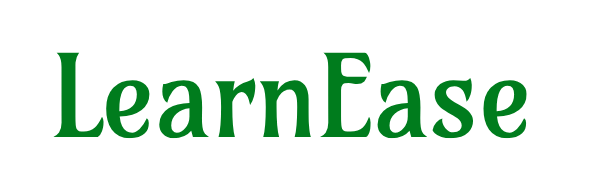
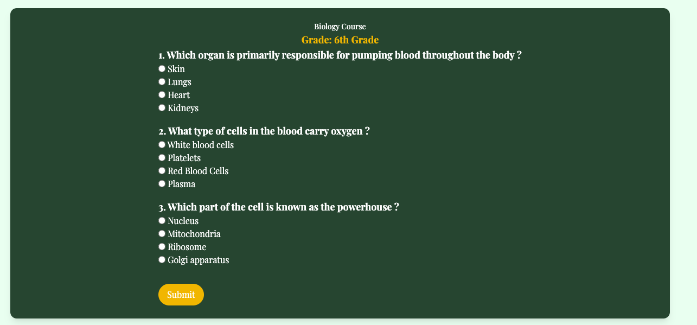
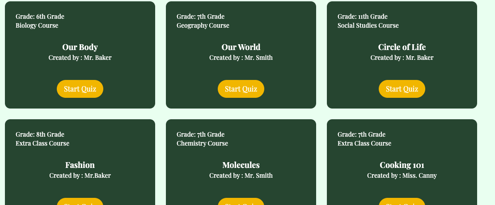

## About Learn Ease
A Learning Management System for Quizzes and Modules

Learn Ease is a comprehensive platform designed to enhance learning through interactive quizzes, engaging course reviews, and diverse educational content. Our goal is to make the learning process enjoyable and accessible for everyone.

We are currently working on the "Your Activity" feature, which will allow users to view all of their activity on the platform. This part is currently hard-coded, but we plan to fully implement it soon.

## Features

- **Quizzes**: View and create quizzes.
- **Teachers/Blog**: Read blogs from educators around the world.
- **Guides**: Access and download PDF guides for enhanced learning.
- **Your Activity**: View your platform activity, including completed quizzes and growth tables. (In Progress)
- **Modules**: Comprehensive learning modules. (In Progress)

## Current Progress

The core functionality is complete. The navigation bar is fully functional, except for the modules section, which is still in development. Authorization and quiz creation features are operational, with data stored in the database. The "Your Activity" feature is in progress.

## Vision 👀

At Learn Ease, we believe learning should be engaging and fulfilling. Our platform simplifies traditional learning methods, making education accessible and enjoyable for everyone.

Enjoy completing thousands of quizzes: 

And when you finish one, more are waiting with a simple layout to help you understand what you're learning: 

## Installation and Setup
1. Clone the repository: `git clone https://github.com/yourusername/learnease.git`
2. Navigate to the project directory: `cd learnease`
3. Install dependencies: `composer install`
4. Set up your environment variables: `cp .env.example .env`
5. Generate an application key: `php artisan key:generate`
6. Run the migrations: `php artisan migrate`
7. Start the development server: `php artisan serve`

## Usage Instructions
1. Register or log in.
2. Explore features via the navigation bar.
3. Create and manage quizzes.
4. Access and download guides.
5. View your activity (after logging in).

## Contributing

We welcome contributions! Please read our [contributing guidelines](CONTRIBUTING.md) to get started.

## License

This project is licensed under the MIT License. See the [LICENSE](LICENSE) file for details.

## Contact Information

For support or questions, contact us at `support@learnease.com`.
