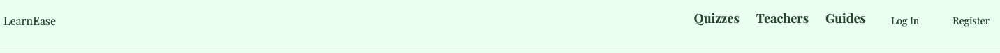
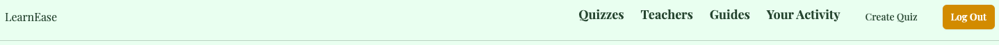

## About Learn Ease
A Learning Management System for Quizzes and Modules

Learn Ease is a comprehensive platform designed to enhance learning through interactive quizzes, engaging course reviews, and diverse educational content. Our goal is to make the learning process enjoyable and accessible for everyone. 

 We are currently working on the "Your Activity" feature, which will allow users to view all of their activity on the platform. This part is currently hard-coded, but we plan to fully implement it soon. This component is in the nav-bar after logging-in.

## Navigation Bar

### Before Logging In:

- Learn Ease: The name of the platform, located on the far left.
- Quizzes: View different quizzes and the ones you have created.
- Teachers/Blog: A section featuring blogs from educators around the world.
- Guides: Access and download PDF guides, containing exclusive content for enhanced learning.
- Log in: Log-in button which after clicking redirects you to the login page.
- Register: Register button which after clicking redirects you to the register page.

#### In Progress:
- Modules: A section where users can access comprehensive learning modules. 🗂

### After Logging In:

- Learn Ease: The name of the platform, located on the far left.
- Quizzes: View different quizzes and the ones you have created.
- Teachers/Blog: A section featuring blogs from educators around the world.
- Guides: Access and download PDF guides, containing exclusive content for enhanced learning.
- Your Activity: View all user activity on the platform, from completed quizzes, edited quizzes, completed quizzes, total completions and growth tables.
- Create Quiz: Logged-in users can create quizzes, which are stored in the database across two tables: quizzes and questions.
- Logout: Log-out button which after clicking redirects you to the home page.

#### In Progress:
 Modules : A section where users can access comprehensive learning modules. 🗂

## Current Progress

The core functionality has been completed. The navigation bar is fully functional, except for the modules section, which is still in development. Authorization and quiz creation features are fully operational, including data storage in the database. We are currently working on the "Your Activity" feature, which will allow users to view all of their activity on the platform. This part is currently hard-coded.

## Vision 👀

At Learn Ease, we believe that learning should be an engaging and fulfilling experience. Our platform is designed to remove the complexities of traditional learning methods, making education accessible and enjoyable for everyone.

## Installation and Setup
1. Clone the repository: git clone https://github.com/yourusername/learnease.git
2. Navigate to the project directory: cd learnease
3. Install dependencies: composer install
4. Set up your environment variables: cp .env.example .env
5. Generate an application key: php artisan key:generate
6. Run the migrations: php artisan migrate
7. Start the development server: php artisan serve

## Usage Instructions
1. Register an account or log in if you already have one.
2. Navigate through the navigation bar to explore features like Quizzes, Teachers/Blog, Guides, etc.
3. Create and manage quizzes from the "Create Quiz" section.
4. Access and download guides from the "Guides" section.
5. View your activity in the "Your Activity" section (after logging in).

## Contributing

We welcome contributions from the community! Please read our `contributing guidelines` to get started.

## License
This project is licensed under the --- License. See the `LICENSE` file for more details.

## Contact Information
For support or questions, please contact us at `support@learnease.com`.

